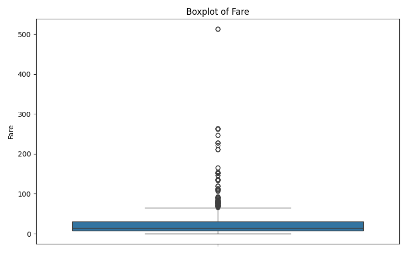

# Titanic-EDA-Hemasri4

This repository contains **Exploratory Data Analysis (EDA)** on the Titanic dataset. The project is done using Python libraries such as **pandas**, **matplotlib**, and **seaborn**. The aim is to understand the data, identify key patterns, and visualize relationships among features that could help predict survival.

## 📊 Dataset Overview

The dataset includes the following features:
- PassengerId, Name, Sex, Age
- Ticket, Fare, Cabin, Embarked
- Pclass, SibSp, Parch
- Survived (Target Variable)

## 📈 Tasks Performed

1. **Loaded the dataset** using `pandas`
2. **Viewed structure** and summarized with `.info()` and `.describe()`
3. **Checked for missing values**
4. **Visualized distributions** using histograms and boxplots
5. **Performed correlation analysis** using heatmaps
6. **Created pairplots** for key numerical features

## 🖼️ Image Outputs

Below are the generated plots saved in the same folder:

### Age Distribution


### Fare Distribution


### Boxplot of Age


### Boxplot of Fare


### Correlation Heatmap


### Pairplot


## 🛠️ Technologies Used

- Python 3
- pandas
- matplotlib
- seaborn

---

### 👩‍💻 Author: **Hemasri4**

```markdown
Feel free to ⭐ star, fork 🍴, or contribute 🛠️ to this project!

